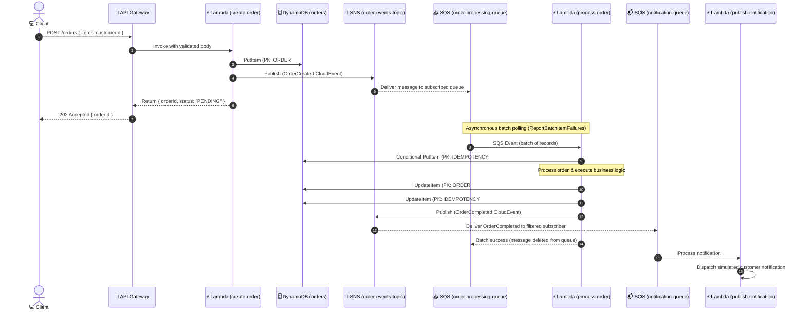
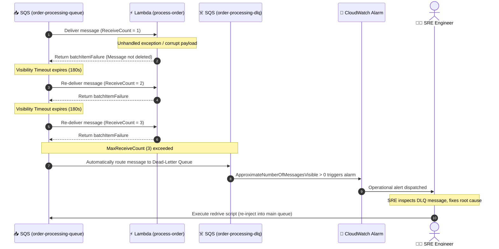

# 🔄 Sequence Diagrams

## 1. Happy Path: Order Ingestion, Asynchronous Processing & Fan-Out

```mermaid
sequenceDiagram
    autonumber
    actor Client as 💻 Client
    participant APIGW as 🚪 API Gateway
    participant CreateLambda as ⚡ Lambda (create-order)
    participant Dynamo as 🗄️ DynamoDB (orders)
    participant SNS as 📢 SNS (order-events-topic)
    participant SQS as 📥 SQS (order-processing-queue)
    participant WorkerLambda as ⚡ Lambda (process-order)
    participant NotifyQueue as 📬 SQS (notification-queue)
    participant NotifyLambda as ⚡ Lambda (publish-notification)

    Client->>APIGW: POST /orders { items, customerId }
    APIGW->>CreateLambda: Invoke with validated body
    CreateLambda->>Dynamo: PutItem (PK: ORDER#id, status: PENDING)
    CreateLambda->>SNS: Publish (OrderCreated CloudEvent)
    SNS-->>SQS: Deliver message to subscribed queue
    CreateLambda-->>APIGW: Return { orderId, status: "PENDING" }
    APIGW-->>Client: 202 Accepted { orderId }

    Note over SQS,WorkerLambda: Asynchronous batch polling (ReportBatchItemFailures)
    SQS->>WorkerLambda: SQS Event (batch of records)
    WorkerLambda->>Dynamo: Conditional PutItem (PK: IDEMPOTENCY#eventId, status: IN_PROGRESS)
    Note over WorkerLambda: Process order & execute business logic
    WorkerLambda->>Dynamo: UpdateItem (PK: ORDER#id, status: COMPLETED)
    WorkerLambda->>Dynamo: UpdateItem (PK: IDEMPOTENCY#eventId, status: COMPLETED)
    WorkerLambda->>SNS: Publish (OrderCompleted CloudEvent)
    SNS-->>NotifyQueue: Deliver OrderCompleted to filtered subscriber
    WorkerLambda-->>SQS: Batch success (message deleted from queue)

    NotifyQueue->>NotifyLambda: Process notification
    NotifyLambda->>NotifyLambda: Dispatch simulated customer notification
```

---

## 2. Failure Path: Poison Pill Isolation & DLQ Redrive

```mermaid
sequenceDiagram
    autonumber
    participant SQS as 📥 SQS (order-processing-queue)
    participant WorkerLambda as ⚡ Lambda (process-order)
    participant DLQ as ☠️ SQS (order-processing-dlq)
    participant CWAlarm as 🚨 CloudWatch Alarm
    actor SRE as 👩‍💻 SRE Engineer

    SQS->>WorkerLambda: Deliver message (ReceiveCount = 1)
    Note over WorkerLambda: Unhandled exception / corrupt payload
    WorkerLambda-->>SQS: Return batchItemFailure (Message not deleted)
    
    Note over SQS: Visibility Timeout expires (180s)
    SQS->>WorkerLambda: Re-deliver message (ReceiveCount = 2)
    WorkerLambda-->>SQS: Return batchItemFailure
    
    Note over SQS: Visibility Timeout expires (180s)
    SQS->>WorkerLambda: Re-deliver message (ReceiveCount = 3)
    WorkerLambda-->>SQS: Return batchItemFailure

    Note over SQS,DLQ: MaxReceiveCount (3) exceeded
    SQS->>DLQ: Automatically route message to Dead-Letter Queue
    DLQ->>CWAlarm: ApproximateNumberOfMessagesVisible > 0 triggers alarm
    CWAlarm->>SRE: Operational alert dispatched
    
    Note over SRE: SRE inspects DLQ message, fixes root cause
    SRE->>SQS: Execute redrive script (re-inject into main queue)
```
